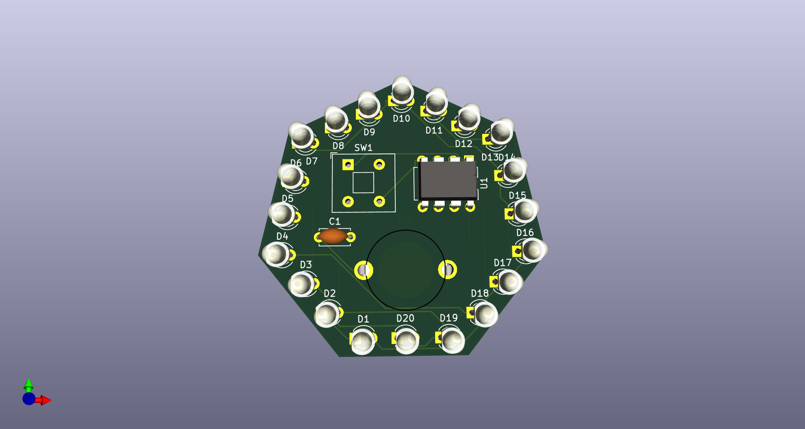

# Charlieplexing-PCB

A custom made charlieplexing PCB designed in KiCAD.
  
Note: This repo contains only the KiCAD files for the PCB. The programmable files are not here, please do not clone this repository.

